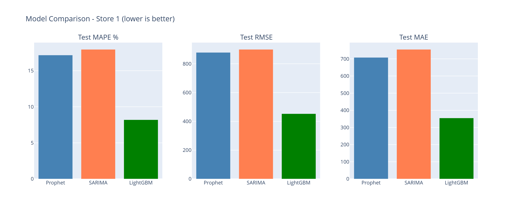
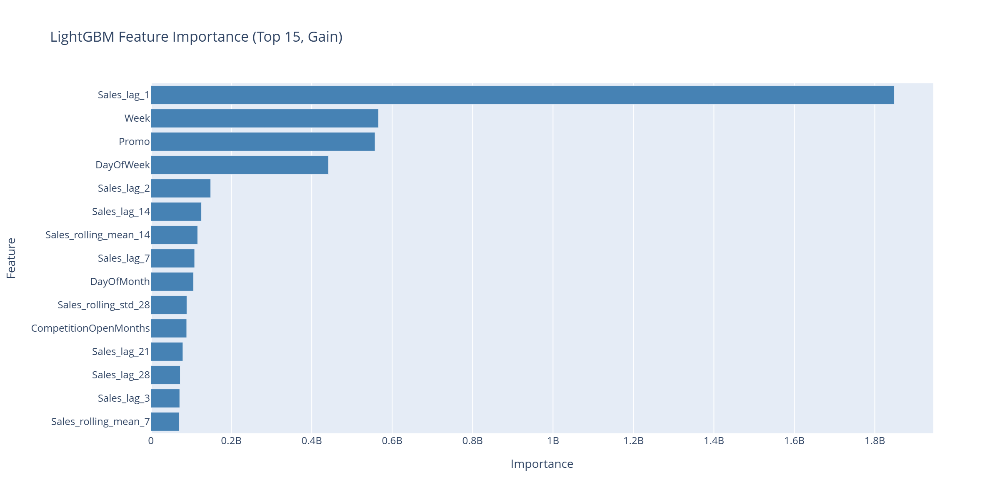
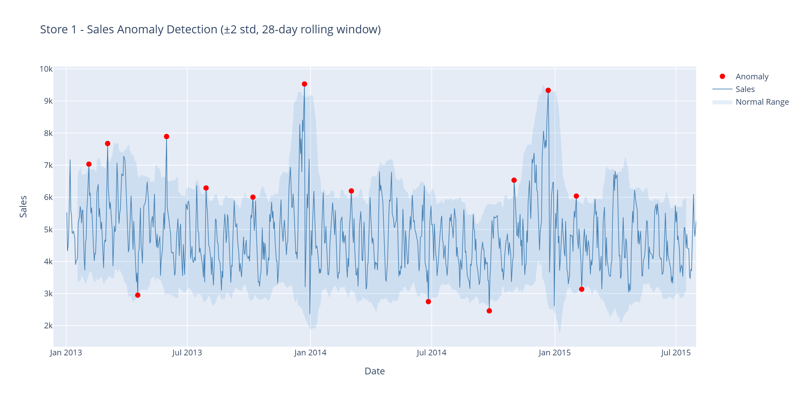

# Demand Forecasting + Anomaly Detection

End-to-end time series forecasting on Rossmann Store Sales — 1M rows, 1115 German drugstores, 3 years of daily data (2013-2015). Three models compared with walk-forward cross-validation, plus anomaly detection on residuals.



---

## Results

| Model    | Test MAPE  | Test RMSE | CV MAPE |
| -------- | ---------- | --------- | ------- |
| **LightGBM** | **8.20%** | **453**   | **9.09%** |
| Prophet  | 17.16%     | 879       | 14.04%  |
| SARIMA   | 17.95%     | 900       | N/A     |

**Winner: LightGBM** — 2x better accuracy than classical statistical models.

## Key Findings

1. **LightGBM dominates** — MAPE 8.20% vs Prophet 17.16% and SARIMA 17.95%
2. **Top predictive features:** `Sales_lag_1` (yesterday's sales), `Week`, `Promo`
3. **Promo impact:** sales increase ~37% on average during promotional periods
4. **December seasonality:** sales peak 60-80% above baseline (Christmas effect)
5. **Anomaly detection:** 14 anomalies flagged (1.8% of test set), 8 of them on Mondays
6. **Anomaly correlation:** high-value anomalies correlate with overlapping promo + holiday windows

## Why This Project

Demand forecasting drives inventory, staffing, and revenue planning decisions in retail and supply chain. I wanted to compare a classical statistical approach (SARIMA), a modern automated approach (Prophet), and a modern ML approach (LightGBM) on the same dataset with the same evaluation methodology — to see where each shines and which one I would actually deploy.

The honest answer: for daily retail data with promotional cycles and lag-based autocorrelation, **modern gradient boosting beats classical time series methods substantially**, mostly because it can use lag features and external regressors (promo, holidays) jointly.

## Methodology

### Walk-Forward Cross-Validation
Random K-fold leaks future into past on time series data — a model trained on future days will trivially predict the past. We use rolling-origin walk-forward CV instead:

```
Fold 1: train 2013-01 → 2013-12   |   test 2014-01
Fold 2: train 2013-01 → 2014-01   |   test 2014-02
Fold 3: train 2013-01 → 2014-02   |   test 2014-03
...
```

Reported `CV MAPE` is averaged across all folds. SARIMA didn't run cross-validation due to fit time (single model takes ~10 min per fold per store).

### Feature Engineering (LightGBM)
- **Lag features:** `Sales_lag_1`, `Sales_lag_7`, `Sales_lag_30`
- **Rolling statistics:** 7-day and 30-day moving averages and standard deviations
- **Calendar:** day-of-week, week-of-year, month, quarter, year
- **Promo:** binary flag + days-since-promo started
- **Holidays:** state holiday flag, school holiday flag, days-to-next-holiday
- **Store features:** store type, assortment, competition distance, promo2 participation

### Anomaly Detection
Residual-based approach: for each model, compute `residual = actual - predicted`. Days where `|residual| > 3 × σ(residuals)` flagged as anomalies. Cross-referenced against promo and holiday windows to separate "real" anomalies (data issues, stockouts) from explainable outliers (mega-promo days).

## Dataset

[Rossmann Store Sales (Kaggle)](https://www.kaggle.com/c/rossmann-store-sales) — 1 million rows, 1,115 stores, 3 years of daily sales.

> Data not included in this repo (~30MB). Download from Kaggle and place CSVs in `data/`.

## Tech Stack

- **Python 3.11+**
- **[LightGBM](https://lightgbm.readthedocs.io)** — gradient boosting (winner)
- **[Prophet](https://facebook.github.io/prophet/)** — Facebook's automated forecasting
- **[statsmodels](https://www.statsmodels.org)** — SARIMA classical statistical approach
- **[Plotly](https://plotly.com/python/)** — interactive visualizations
- **pandas, numpy, scikit-learn** — data wrangling and metrics

## Project Structure

```
demand-forecasting/
├── notebooks/
│   ├── 01_eda.ipynb                       # Exploratory Data Analysis
│   ├── 02_feature_engineering.ipynb       # Lags, rolling stats, calendar features
│   ├── 03_prophet_model.ipynb             # Prophet + walk-forward CV
│   ├── 04_arima_model.ipynb               # SARIMA fitting
│   ├── 05_lightgbm_model.ipynb            # LightGBM + feature importance
│   └── 06_comparison_and_anomaly.ipynb    # Model comparison + anomaly detection
├── data/                                  # Not in repo - download from Kaggle
│   ├── train.csv
│   ├── test.csv
│   ├── store.csv
│   └── sample_submission.csv
├── docs/
│   ├── model_comparison.png
│   ├── feature_importance.png
│   └── anomalies.png
├── requirements.txt
├── .gitignore
└── README.md
```

## Setup

### 1. Clone the repo

```bash
git clone https://github.com/nurbolsultanov/demand-forecasting.git
cd demand-forecasting
```

### 2. Create virtual environment

```bash
python -m venv venv

# Windows
venv\Scripts\activate

# Mac/Linux
source venv/bin/activate
```

### 3. Install dependencies

```bash
pip install -r requirements.txt
```

If `prophet` installation fails on Windows, try:
```bash
pip install prophet --no-build-isolation
```
or use conda: `conda install -c conda-forge prophet`.

### 4. Download data

1. Go to [kaggle.com/c/rossmann-store-sales/data](https://www.kaggle.com/c/rossmann-store-sales/data)
2. Click **Download All** (requires Kaggle account)
3. Unzip into `data/` folder

### 5. Run notebooks in order

```bash
jupyter notebook
```

Open notebooks `01_eda.ipynb` through `06_comparison_and_anomaly.ipynb` and run cells sequentially.

## Visualizations

### LightGBM Feature Importance


Lag features and promo flags dominate over pure seasonality components — confirming that daily retail data is strongly autocorrelated and promo-driven, not just seasonal.

### Anomaly Detection


Anomalies cluster around overlapping promo + holiday windows. Most flagged days are explainable; a handful are likely data issues worth investigating.

## Limitations

- **Single-store focus in detailed analysis.** Comparison done on a representative store; full multi-store deployment would require per-store hyperparameter tuning or hierarchical modeling.
- **No external regressors.** Weather, competitor pricing, and local events not included — they would likely lift LightGBM further.
- **SARIMA didn't run CV.** Walk-forward CV across folds was prohibitively slow for SARIMA on this dataset. Reported test MAPE is on a single holdout window.
- **Anomaly detection is residual-based.** A more rigorous approach would use isolation forests or seasonal-trend decomposition. Current method works well for residual outliers but won't catch sustained regime shifts.

## Future Work

- Hierarchical forecasting across all 1,115 stores
- Hyperparameter tuning via Optuna
- Ensemble of LightGBM + Prophet for robustness
- Streamlit dashboard wrapping forecasts and anomalies for interactive exploration
- Probabilistic forecasts (quantile regression) instead of point estimates
- External regressors: weather data, competitor pricing

## About the Author

Built by **Nurbol Sultanov** — Data Analyst in Los Angeles working in credit risk, fraud detection, and forecasting.

- 🔗 [LinkedIn](https://linkedin.com/in/nurbolsultanov)
- 💻 [GitHub](https://github.com/nurbolsultanov)
- 📊 [Tableau Portfolio](https://public.tableau.com/app/profile/nurbol.sultanov)
- 🚀 [Live Demo — AI Resume-JD Matcher](https://resume-matcher-nurbolsultanov.streamlit.app/)

## License

MIT — feel free to fork, modify, and use for your own forecasting projects.
